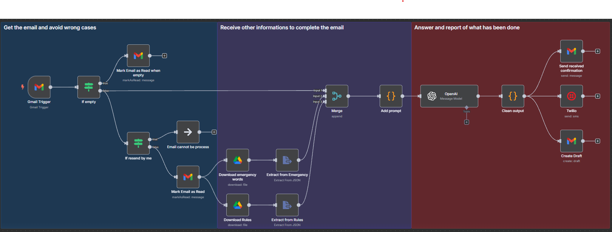

# auto_client_answer

Générez automatiquement des réponses à vos e-mails avec un workflow **n8n** basé sur l’IA. Ce projet vous fait gagner un temps précieux en exploitant des fichiers pour enrichir les réponses générées.

## Fonctionnalités

- Lecture automatique du contenu d’un e-mail
- Construction dynamique d’un prompt incluant des fichiers d’aide
- Génération d’une réponse grâce à une API IA (OpenAI ou autre)
- Option de vérification manuelle ou envoi automatique
- Orchestration complète avec **n8n**, facilement modifiable

## Exemple de cas d’usage

- Support client (réponses à des tickets simples)
- Suivi commercial automatisé
- Qualification de leads entrants
- Réponses FAQ à partir de documents internes

## Schéma du workflow

## Pourquoi ça marche

Le workflow combine une logique simple mais efficace :
- Une IA bien guidée produit des réponses utiles
- n8n facilite l’automatisation sans écrire une ligne de code
- Les fichiers intégrés au prompt rendent les réponses pertinentes et personnalisées

## Prérequis

- Une instance n8n (locale ou cloud)
- Un compte OpenAI
- Des fichiers sources (optionnels mais recommandés) pour contextualiser les réponses

## Lancer le projet

1. Clonez le repo
2. Importez le fichier `.json` dans votre instance n8n
3. Ajoutez vos credentials (API Key OpenAI, email source, etc.)
4. Modifiez le prompt de base si nécessaire
5. Activez le workflow